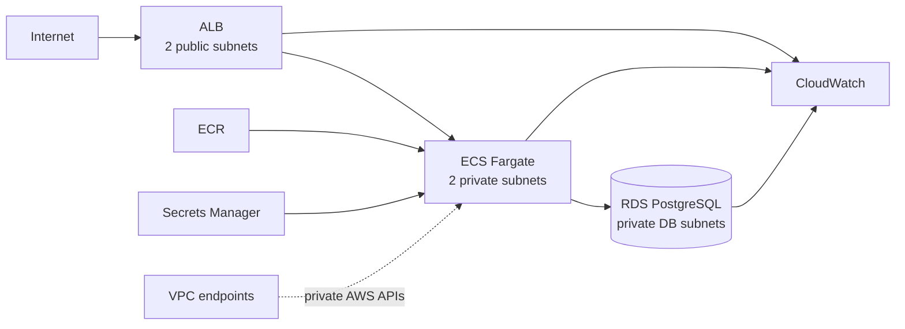

# Production-oriented AWS Container Platform


## Overview

This portfolio builds a small FastAPI service on AWS using Terraform:

**Internet → public ALB → private ECS Fargate → private RDS PostgreSQL**

It is a learning and validation environment designed around production concerns; it is not presented as universally production-ready. The focus is safe infrastructure change, explicit trust boundaries, observable failure, and incident investigation—not the number of AWS services used.

## What this portfolio demonstrates

- Terraform module boundaries, version constraints, remote state, validation, and plan review.
- Native Terraform mock-plan tests for architecture and bootstrap invariants.
- A container release identified by an immutable Git commit SHA rather than `latest`.
- Two-AZ ingress/runtime placement with private tasks and database.
- Separate ECS execution/task roles and SG-to-SG network permissions.
- Monitoring ordered by user impact, service health, then infrastructure saturation.
- SLI/SLO reasoning, three incident investigations, and a blameless postmortem.
- GitHub Actions with OIDC, approval-gated deployment, static analysis, tests, and image build.

## Validation snapshot

| Area | Status |
| --- | --- |
| Terraform format / init / validate / mock tests | See [current validation record](docs/VALIDATION.md) |
| Application tests / Docker build / container `/health` | See [current validation record](docs/VALIDATION.md) |
| Real AWS plan and deployment | **BLOCKED** — no AWS identity or resource-creation approval |
| GitHub Actions execution | **PASS (non-AWS jobs)** — pytest, Docker build, Trivy image scan, fmt/validate/mock-tests, tflint, Trivy config scan; AWS plan/deploy jobs **NOT RUN** (no credentials) |

The distinction between static design, local execution, and real AWS evidence is intentional. See the [audit](docs/AUDIT.md) and [publication report](docs/PUBLICATION_REPORT.md).

## Architecture



See [the detailed architecture](docs/ARCHITECTURE.md) for boundaries and the NAT decision.

## Technology stack

Terraform 1.14, AWS Provider 6.x, VPC, ALB, ECS Fargate, ECR, RDS PostgreSQL, Secrets Manager, IAM, CloudWatch, SNS, FastAPI, Docker, pytest, GitHub Actions, tflint, and Trivy.

## Repository structure

```text
app/                 FastAPI application, tests, and Docker image
bootstrap/           Independent S3 state-bucket configuration
infra/               Workload root module
infra/modules/       network, service, database, monitoring
docs/                architecture, SLO, incidents, postmortem, validation
.github/              CI/CD and pull-request template
MIGRATION_PLAN.md     evidence-based disposition of the previous project
```

## Design decisions and trade-offs

- **Two AZs:** ALB and ECS can tolerate one placement-zone failure. RDS is Single-AZ by default to control portfolio cost; `db_multi_az=true` models the production choice.
- **No NAT by default:** ECR API/DKR, CloudWatch Logs, Secrets Manager interface endpoints and an S3 gateway endpoint provide required AWS paths. This deliberately prevents general internet egress, but several interface endpoints have meaningful hourly cost.
- **Liveness versus readiness:** ALB and container health use `/health`, which tests the process. `/ready` tests PostgreSQL. Making database readiness the liveness check could restart every task during a dependency incident and amplify failure.
- **HTTP for the disposable demo:** the public listener is HTTP to avoid requiring a domain and certificate. Production must terminate TLS with ACM, redirect HTTP to HTTPS, and define an appropriate security policy.
- **Controlled service bootstrap:** `enable_service=false` creates the ECR repository and platform without starting an image that does not exist. Push a SHA-tagged image, then enable the service.
- **Apply requires approval:** CI produces a plan; deployment is a manually dispatched job protected by the GitHub `production` Environment. This keeps an accountable human decision before infrastructure mutation.

## Security

- Only ALB port 80 is open to `0.0.0.0/0`; ECS and RDS use referenced security groups.
- ECS tasks and RDS have no public address/path.
- RDS storage and ECR images are encrypted at rest.
- RDS manages its master password in Secrets Manager; no password is stored in Git or a Terraform variable.
- The execution role can retrieve only the referenced database secret. The task role intentionally has no AWS permissions.
- ECR tags are immutable and images are scanned on push.
- Alarm messages use the AWS-managed SNS KMS key; production can use a customer-managed key when policy, audit, or cross-account control requires it.
- State bucket public access is blocked, versioned, encrypted, and TLS-only.

The AWS-managed ECS execution policy contains service-required resource scopes. Application AWS permissions must be added to the task role as narrowly scoped policies; Administrator access is not used.

## Terraform state management

State can contain infrastructure metadata and sensitive values, so it is kept out of Git and stored in a separately bootstrapped S3 bucket. Versioning supports recovery from accidental overwrite. S3-native locking (`use_lockfile=true`) prevents concurrent writers; DynamoDB locking is not used because it is deprecated in current Terraform. HashiCorp recommends S3 locking and bucket versioning in the [S3 backend documentation](https://developer.hashicorp.com/terraform/language/backend/s3).

For a team, restrict state and `.tflock` paths by IAM role/environment, never bypass a lock casually, review `force-unlock`, and serialize apply jobs. The bootstrap uses local state initially and must itself be protected or migrated after creation; it is intentionally not dependent on the bucket it creates.

## CI/CD

Pull requests run:

- pytest and Docker build;
- `terraform fmt -check`, `init -backend=false`, and `validate`;
- Terraform mock-plan tests, tflint, and Trivy configuration scanning;
- Trivy image vulnerability/secret scanning after the Docker build;
- `terraform plan` for trusted same-repository PRs using GitHub OIDC.

Fork PRs do not receive AWS credentials and therefore skip the plan job. Configure repository variable `TF_STATE_BUCKET`, secret `AWS_ROLE_ARN`, GitHub Environments named `plan` and `production`, and a narrowly scoped AWS OIDC role. Deployment builds/pushes `${GITHUB_SHA}`, displays and applies a saved plan, waits for ECS stability, and checks `/health`. Image signing/attestation, a private-path `/ready` check, and an explicit automated rollback policy remain production follow-ups.

## Observability

Application stdout/stderr is retained in CloudWatch Logs for 30 days. Container Insights supplies ECS signals. Alarms cover:

- user impact: target 5xx rate above 1% (with a low-traffic guard) and p95 latency above 500 ms;
- service health: unhealthy ALB targets;
- infrastructure: sustained ECS CPU/memory and RDS CPU/connections.

Thresholds are starting hypotheses for a low-traffic portfolio. They require tuning from baselines, instance limits, and real user behavior. SNS is created for routing; setting `alarm_email` creates a subscription that must be confirmed.

## SLI / SLO

The initial availability objective is 99.9% non-5xx responses over 30 days; latency is p95 below 500 ms. The resulting availability error budget is 0.1%, about 43 minutes of equivalent total failure in 30 days. These are learning targets, not business commitments. See [SLI/SLO and error-budget reasoning](docs/SLI_SLO.md).

## Incident response

[Incident simulations](docs/INCIDENTS.md) cover unhealthy ALB targets, blocked ECS-to-RDS traffic, and Secrets Manager `AccessDenied`. Each records symptoms, impact, detection, hypotheses, evidence-driven investigation, root cause, resolution, permanent fix, and prevention. A [blameless postmortem](docs/POSTMORTEM.md) models the secret-permission incident.

## Deploy

Prerequisites: Terraform 1.14.x, Docker, AWS CLI v2, an isolated AWS account/role, and explicit acceptance of cost.

```bash
cd bootstrap
terraform init
terraform apply -var="state_bucket_name=<globally-unique-bucket-name>"

cd ../infra
cp backend.hcl.example backend.hcl
# Edit only the non-secret bucket/key/region values.
terraform init -backend-config=backend.hcl
terraform fmt -check -recursive
terraform validate
terraform plan -out=tfplan
terraform apply tfplan

ECR_URL=$(terraform output -raw ecr_repository_url)
IMAGE_TAG=$(git rev-parse HEAD)
aws ecr get-login-password --region ap-northeast-1 | \
  docker login --username AWS --password-stdin "${ECR_URL%%/*}"
docker build -t "$ECR_URL:$IMAGE_TAG" ../app
docker push "$ECR_URL:$IMAGE_TAG"

terraform plan -var="image_tag=$IMAGE_TAG" -var="enable_service=true" -out=tfplan
terraform apply tfplan
curl "$(terraform output -raw alb_url)/health"
```

Always inspect the saved plan with `terraform show tfplan` and use the [plan review checklist](docs/TERRAFORM_PLAN_REVIEW.md). Do not apply a stale plan.

## Destroy

Disable deletion protection only through a reviewed plan, then:

```bash
cd infra
terraform plan -destroy -out=destroy.tfplan
terraform show destroy.tfplan
terraform apply destroy.tfplan
```

The state bucket has `prevent_destroy=true` and is intentionally removed separately only after state retention/export is decided. ECR `force_delete=true` and non-production RDS `skip_final_snapshot=true` prioritize cleanup in this disposable environment; production settings should retain evidence and recovery points.

## Cost considerations

The principal running charges are ALB hours/LCUs, four interface VPC endpoints across two AZs, Fargate task time, RDS instance/storage/backups, and CloudWatch ingestion/retention. ECR storage and S3 state are smaller but not free. The endpoint design is not guaranteed cheaper than NAT; estimate the selected region and expected traffic using the AWS Pricing Calculator before deployment, set a budget alarm outside this stack, and destroy the environment after validation.

## Production considerations

Before production use: add Route 53/ACM/HTTPS, WAF as threat modeling requires, Multi-AZ RDS and tested restore, autoscaling, structured application telemetry and tracing, secret-rotation behavior, customer-managed keys where policy requires, image signing/SBOM, deployment-event alerting, canaries, backup-policy ownership, and organization-level audit/security controls.

## Lessons learned

The most important boundary is not a Terraform module—it is the contract between release, network, identity, health, and operations. Separating liveness from readiness, separating execution from task permissions, and requiring an immutable artifact plus reviewed plan make failure modes easier to explain and safer to recover from.

## Honest scope

Terraform, container, CI/CD, SLI/SLO, and incident artifacts here are personal implementation/validation work. They should not be represented as production operation at an employer. The repository demonstrates transferable infrastructure reasoning while keeping that distinction explicit.
