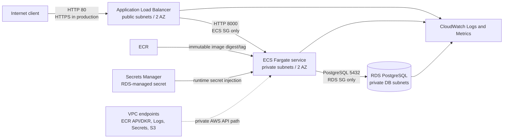

# Architecture and decisions

## Boundaries

- Only the ALB accepts internet ingress.
- ECS accepts application traffic only from the ALB security group.
- RDS accepts PostgreSQL only from the ECS security group.
- ECS tasks have no public IP address.
- Interface endpoints and an S3 gateway endpoint provide the AWS API paths required to pull ECR images, write logs, and retrieve the database secret without a NAT gateway.

## NAT decision

The default portfolio environment uses VPC endpoints and no NAT gateway. This makes the workload's external dependencies explicit and avoids routing arbitrary outbound traffic through a NAT. Interface endpoints also incur hourly charges and can cost more than a single NAT gateway, so this is an architectural demonstration rather than a blanket cost claim. A production decision would compare required destinations, traffic volume, availability requirements, centralized egress controls, and endpoint count.

## Availability scope

ALB and ECS span two Availability Zones. The portfolio default keeps RDS Single-AZ to reduce cost; production should normally use Multi-AZ after evaluating the availability target and recovery requirements. This distinction is exposed as a Terraform variable rather than hidden in code.
